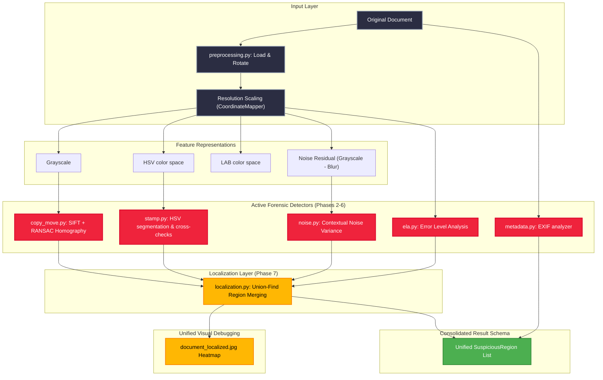

<div align="center">
  
  <h1>🛡️ DOCSHIELD AI: IMAGE FORENSICS ENGINE</h1>
  <p><b>Advanced Identity & Document Screening System — Tampering Detection Module</b></p>
  
  <!-- Animated Badges -->
  <p>
    
    
    
    
  </p>
  
</div>

## Project Overview

This directory houses the Python-based Document Tampering and Forensic Analysis module for the **DocShield AI** platform. It is built to run entirely on **CPUs** while maintaining demo reliability, high processing speeds, and strict mathematical explainability for college hackathons.

> [!NOTE]
> **Phase 7 Status:** ELA, Noise, Copy-Move, Metadata, Stamp, and Unified Region Localization engines are fully active and tested. Splicing remains a skeleton placeholder.

---

## Folder Structure

```
AI/
└── Image_Tampering/
    ├── app/
    │   ├── __init__.py
    │   ├── main.py                     # FastAPI application layer
    │   │
    │   ├── forensic/
    │   │   ├── __init__.py
    │   │   ├── pipeline.py             # Orchestrates the image processing pipeline
    │   │   ├── preprocessing.py        # Safe loading, EXIF correction, resizing, coordinate mapping
    │   │   ├── quality.py              # Quality calculations (brightness, contrast, sharpness, blur flag)
    │   │   ├── representations.py      # Conversions (Grayscale, HSV, LAB, Noise Residual)
    │   │   ├── ela.py                  # [Active] ELA Forensic Engine (Phase 2)
    │   │   ├── noise.py                # [Active] Noise Forensic Engine (Phase 3)
    │   │   ├── copy_move.py            # [Active] Copy-Move Forensic Engine (Phase 4)
    │   │   ├── metadata.py             # [Active] EXIF Metadata Analyzer (Phase 5)
    │   │   ├── stamp.py                # [Active] Stamp Engine with overlaps check (Phase 6)
    │   │   ├── localization.py         # [Active] Unified Region Localization Engine (Phase 7)
    │   │   │
    │   │   ├── splicing.py             # [Skeleton] Splicing Detector Placeholder
    │   │   └── fusion.py               # [Skeleton] AI/ML Signal Fusion Placeholder
    │   │
    │   └── schemas/
    │       ├── __init__.py
    │       └── forensic.py             # Pydantic schemas validating API payloads
    │
    ├── tests/                          # Automated unit tests (pytest)
    │   ├── test_preprocessing.py
    │   ├── test_quality.py
    │   ├── test_ela.py                 # [Phase 2] ELA test suite
    │   ├── test_noise.py               # [Phase 3] Noise test suite
    │   ├── test_copy_move.py           # [Phase 4] Copy-Move test suite
    │   ├── test_metadata.py            # [Phase 5] Metadata test suite
    │   ├── test_stamp.py               # [Phase 6] Stamp test suite
    │   └── test_localization.py        # [Phase 7] Localization test suite
    │
    ├── samples/                        # Mock clean and tampered document images
    │   ├── clean/
    │   └── tampered/
    │
    ├── outputs/
    │   └── debug/                      # Generated visual debug images
    │
    ├── test_pipeline.py                # CLI test runner script
    ├── generate_samples.py             # Helper to build mock passport and documents
    ├── requirements.txt                # CPU-friendly package dependencies
    └── README.md                       # Documentation
```

---

## 🚀 Pipeline & Execution Architecture

The pipeline processes input images through sequential, isolated modules to ensure speed, CPU compatibility, and safety. Below is the multi-stage visual flow chart:



### Coordinate Mapping (CoordinateMapper)

When processing high-resolution scans, downscaling is necessary to remain CPU-friendly. The `CoordinateMapper` class tracks the exact spatial mapping:

$$scale_x = \frac{width_{working}}{width_{original}}$$
$$scale_y = \frac{height_{working}}{height_{original}}$$

This ensures that whenever ELA, Noise, Copy-Move, or Stamp analysis locates suspicious regions in the working image, the bounding boxes can be mapped back to the original document coordinates with pixel accuracy.

---

## 🔎 Active Forensic Detectors (Phases 2-6)

### Phase 2: Error Level Analysis (ELA) Engine
ELA identifies compression inconsistencies within a digital document by comparing the original image with its recompressed counterpart. Since digital modifications (pasting, cloning, overlays, text insertions) alter the local frequency layout, edited regions compress differently than un-edited regions.

* **Amplification Factor**: $20$
* **Anomaly Score Formula**:
  $$\text{score} = 0.4 \times \left(\frac{\text{mean\_error}}{8.0}\right) + 0.4 \times \left(\frac{\text{std\_error}}{6.0}\right) + 0.2 \times \left(\frac{\text{high\_error\_ratio}}{0.10}\right)$$

### Phase 3: Noise / Texture Analysis
Noise Analysis identifies regions within a document whose high-frequency noise texture differs significantly from neighboring areas due to splicing modifications.
* **Vectorized Variance computation**:
  $$\text{std\_small} = \sqrt{\text{clip}(Var(I), 0, \text{None})}$$
* **Neighborhood Context Normalization**:
  $$\text{anomaly\_map} = \text{clip}\left(\frac{|\text{std\_small} - \text{std\_large}|}{3.0 \times \max(\sigma_{global}, 4.0) + 1e-5}, 0.0, 1.0\right)$$

### Phase 4: Copy-Move Detection
Flags duplicate regions within a document, identifying cases where a signature, stamp, photo, or block of text was duplicated and pasted.
* **Tuned Matching Parameters**: Lowe's SIFT ratio test is set to `0.60` and the RANSAC inlier threshold is set to `8` to reject background layout patterns.
* **Confidence-based Scoring**:
  $$\text{base\_score} = 0.4 + 0.6 \times \frac{\min(\text{largest\_cluster}, 20) - 8}{12.0}$$

### Phase 5: Metadata Forensics
Extracts image format headers and EXIF fields to check for editing software tags (Photoshop, GIMP, Canva) and chronological timestamp inconsistencies. GPS coordinates are audited for privacy (`gps_present` is flagged, but exact coordinate numbers are scrubbed from outputs).

### Phase 6: Stamp Analysis
Segment doc stamp shapes (red, blue, or purple ink) and cross-checks them against overlapping ELA, Noise, and Copy-Move regions.
* **Ink Extraction HSV limits**:
  - *Red*: $H \in [0, 15] \cup [165, 180]$
  - *Blue/Purple*: $H \in [95, 145]$
* **Overlap Scoring**: Swaps static additions for dynamic, severity-weighted values with compound signal bonuses. Legitimate original stamps remain `LOW` risk.

---

## 🎯 Phase 7: Suspicious-Region Localization Engine

### Objective
Combine overlapping/associated bounding boxes produced by the independent detectors (ELA, Noise, Copy-Move, Stamp) into a single, unified visual layout of document modifications.

### Connected-Components Merging Math
To determine if two suspicious regions $B_1$ and $B_2$ represent the same tampering, the engine calculates the **Intersection over Smaller Area** ratio:

$$\text{Overlap Ratio} = \frac{\text{Area}(B_1 \cap B_2)}{\min(\text{Area}(B_1), \text{Area}(B_2))}$$

If the Overlap Ratio $> 0.3$, the boxes are considered overlapping. The engine uses a **Union-Find Disjoint-Set** algorithm to discover connected components of overlapping boxes and merges them:
1. **Union Box**: Takes the bounding box covering the entire union:
   - $x_{new} = \min(x_1, x_2)$
   - $y_{new} = \min(y_1, y_2)$
   - $w_{new} = \max(x_1 + w_1, x_2 + w_2) - x_{new}$
   - $h_{new} = \max(y_1 + h_1, y_2 + h_2) - y_{new}$
2. **Maximum Score**: Keeps the maximum confidence score in the component.
3. **Maximum Severity**: Retains the highest severity level (`HIGH` > `MEDIUM` > `LOW`).
4. **Source Concatenation**: Concatenates individual sources (e.g. `"copy_move+ela+stamp"`).
5. **Reason Concatenation**: Joins reasons with a pipe delimiter (`|`).
6. **Copy-Move Targets**: Preserves target coordinates if a copy-move region is part of the component.

### Heatmap Output (`document_localized.jpg`)
Unified regions are overlayed on the working image using colored rectangles:
* 🟥 **Red**: HIGH severity anomalies.
* 🟧 **Orange**: MEDIUM severity anomalies.
* 🟩 **Green**: LOW severity anomalies.
* Copy-Move duplicates draw target boxes in magenta and link source-target centers with cyan lines.

---

## 🛠️ Installation & Setup

Ensure Python 3.10+ is installed on your system. Run these commands from the `AI/Image_Tampering/` folder:

1. **Set up a Virtual Environment**:
   ```bash
   python -m venv venv
   ```

2. **Activate the Environment**:
   * **Windows (PowerShell)**:
     ```powershell
     .\venv\Scripts\Activate.ps1
     ```
   * **macOS/Linux**:
     ```bash
     source venv/bin/activate
     ```

3. **Install Dependencies**:
   ```bash
   pip install -r requirements.txt
   ```

---

## 📈 Running & Verifying Pipeliners

### 1. Generate Clean & Tampered Samples
```bash
python generate_samples.py
```
This builds mock documents in `samples/`:
* `samples/clean/passport.jpg`: Clean passport.
* `samples/tampered/copy_move.jpg`: Passport with the stamp duplicated.
* `samples/tampered/passport_edited.jpg`: Passport with spliced photo/signature.
* `samples/tampered/stamp_tampered.jpg`: Passport with shifted/recolored stamp.

### 2. Run the CLI test script
```bash
# Windows
.\venv\Scripts\python.exe test_pipeline.py samples/tampered/copy_move.jpg
```

---

## 🧪 Automated Regression Tests

We verify all detectors and the localization layer using pytest:
```powershell
.\venv\Scripts\python.exe -m pytest tests/ -v
```

All **54 tests** must pass. 

---

<div align="center">
  
  <p><b>DocShield AI © 2026. Made with ❤️ by the DocShield Forensics Team.</b></p>
  <p><i>Empowering automated trust in document authentication.</i></p>
</div>
