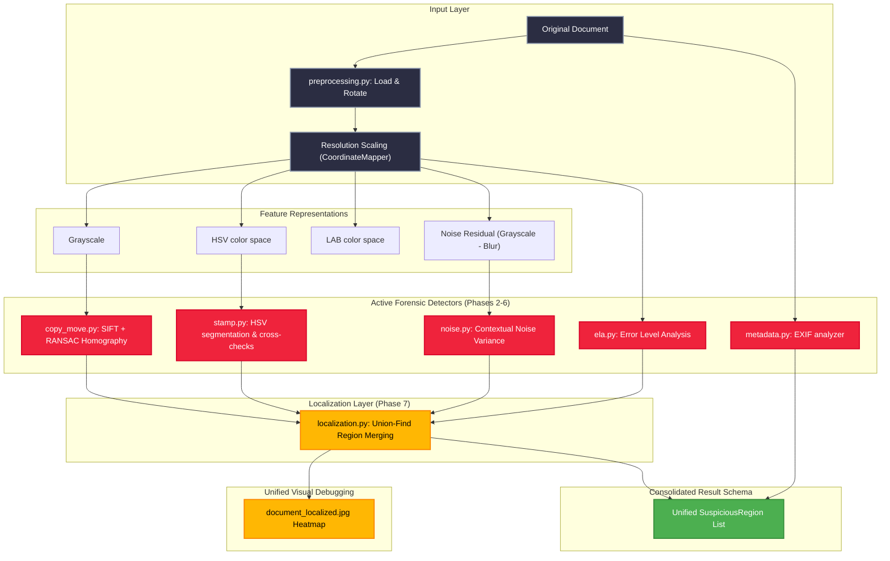

<div align="center">
  
  <h1>🛡️ DOCSHIELD AI: ENTERPRISE SECURITY SCREENING</h1>
  <p><b>Automated Identity Verification & Document Tampering Forensics Engine</b></p>
  
  <!-- Animated Badges -->
  <p>
    
    
    
    
  </p>
  
</div>

## 📂 Project Structure

```text
DocShield-AI/
├── AI/                           # AI Document Tampering Forensics Module
│   └── Image_Tampering/          # Image processing, forensic algorithms & tests
│       ├── app/
│       │   ├── forensic/         # Preprocessing, ELA, Noise, SIFT Copy-Move, Stamp & Localization
│       │   └── schemas/          # Centralized Pydantic schemas validating results
│       ├── tests/                # 54+ Automated pytest verification suites
│       ├── samples/              # Mock clean and tampered travel document samples
│       ├── requirements.txt      # CPU-optimized Python packages
│       └── README.md             # Visual breakdown of forensic algorithms
│
├── backend/                      # Node.js + Express + MySQL Backend (No ORM, Pure SQL)
│   ├── src/
│   │   ├── config/               # Environment validation (Zod) & permission RBAC roles
│   │   ├── controllers/          # HTTP controllers (Auth, Users, Roles, Audit, Health)
│   │   ├── database/             # Prepared SQL statements, migrations & seeds
│   │   │   └── migrations/       # Versioned database schema migrations (001-008)
│   │   ├── errors/               # Operational error handlers
│   │   ├── middleware/           # JWT, rate limiters, permission validations
│   │   ├── repositories/         # Parameterized prepared SQL statement execution
│   │   ├── routes/               # Versioned API routes (/api/v1/...)
│   │   ├── services/             # Auth, Users, Roles, Audit logging
│   │   └── utils/                # JWT signing, Bcrypt, Logger utilities
│   ├── tests/                    # Automated REST API endpoint tests
│   └── package.json
│
├── frontend/                     # React 19 + TypeScript + Vite + Tailwind CSS + Three.js
│   ├── src/
│   │   ├── components/           # UI components & interactive 3D scanner views
│   │   ├── context/              # Centralized Auth & Scene context provider
│   │   ├── hooks/                # useAuth, useTheme, useReducedMotion
│   │   └── lib/api/              # API Client with token-rotation interceptors
│   └── package.json
│
└── README.md                     # Root documentation
```

---

## 🛠️ System Overview & Forensic Pipeline

DocShield AI utilizes a multi-layered screening pipeline. Document images uploaded via the frontend are verified by the backend and analyzed by the Python **AI Forensics Module** across **7 unified analysis phases**:



---

## 🚀 Getting Started

### 1. Setting up the AI Forensics Module

Navigate to the `AI/Image_Tampering/` directory and configure the environment:

```bash
# Navigate to the AI directory
cd AI/Image_Tampering

# Set up a virtual environment
python -m venv venv

# Activate the environment
# Windows:
.\venv\Scripts\Activate.ps1
# macOS/Linux:
source venv/bin/activate

# Install requirements
pip install -r requirements.txt

# Generate clean and tampered samples for testing
python generate_samples.py

# Run the complete automated test suite (54+ test cases)
.\venv\Scripts\python.exe -m pytest tests/ -v

# Run manual CLI test on stamp_tampered sample
.\venv\Scripts\python.exe test_pipeline.py samples/tampered/stamp_tampered.jpg
```

---

### 2. Setting up the Backend

Ensure you have **Node.js v18+** and a **MySQL v8.0+** server running.

```bash
# Navigate to backend directory
cd backend

# Install dependencies
npm install

# Copy configuration
cp .env.example .env

# Run database migrations
npm run migrate

# Seed RBAC system roles, permissions, and initial accounts
npm run seed
```

#### Seeded Accounts:
- **Super Administrator**: `admin@docshield.ai` | `AdminPassword123!`
- **Screening Officer**: `officer@docshield.ai` | `OfficerPassword123!`

```bash
# Start development server
npm run dev
```

---

### 3. Setting up the Frontend

```bash
# Navigate to frontend directory
cd frontend

# Install dependencies
npm install

# Start development server
npm run dev
```

Open `http://localhost:5173` in your browser.

---

## 🔐 Core Security & Forensics Implementation

1. **Direct Parameterization**: Prepared database queries strictly eliminate SQL injection threats.
2. **Dual-Token Authentication**: Rotating refresh tokens prevent session hijacking.
3. **Advanced Forensic Signatures**:
   - **Phase 2 (ELA)**: Localized pixel differences under quality recompression check compression boundaries.
   - **Phase 3 (Noise Analysis)**: Identifies local paper noise variance standard deviations contextually.
   - **Phase 4 (Copy-Move)**: SIFT keypoint mapping paired with iterative RANSAC homography filters cloned items.
   - **Phase 6 (Stamp Audit)**: HSV segmentations filter out stamp boundary editing traces.
   - **Phase 7 (Localization)**: Disjoint-set Union-Find algorithm merges overlapping suspicious regions into a single consolidated heatmap (`document_localized.jpg`).

---

<div align="center">
  
  <p><b>DocShield AI © 2026. Made with ❤️ by the DocShield Forensics Team.</b></p>
  <p><i>Empowering automated trust in document authentication.</i></p>
</div>
