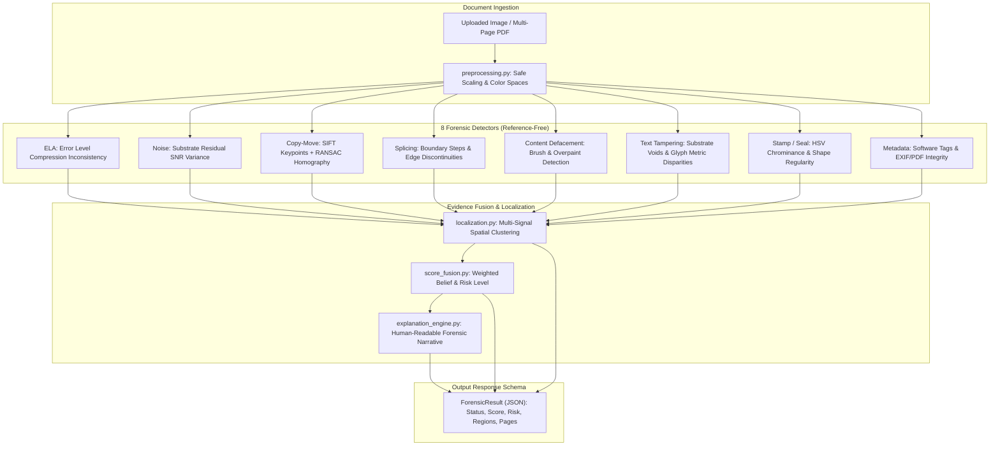

<div align="center">
  
  <h1>🛡️ DOCSHIELD AI: ENTERPRISE SECURITY SCREENING</h1>
  <p><b>Automated Identity Verification, OCR Extraction & Document Tampering Forensics Engine</b></p>
  
  <!-- Animated Badges -->
  <p>
    
    
    
    
  </p>
  
</div>

## 📂 Project Structure

```text
DocShield-AI/
├── AI/                           # Unified FastAPI AI Microservices & Forensic Engine
│   ├── api/                      # FastAPI Routers (Document Detection, Face, Tampering)
│   ├── document_detection/       # Module 1 & 2: OCR Extraction (PaddleOCR/RapidOCR) & ICAO 9303 Checksums
│   ├── face/                     # Module 4: 1:1 ArcFace Biometrics & Phase 5 Active Liveness
│   ├── image_tampering/          # Module 3: Multi-Signal Forensic Tampering Detection Engine
│   │   ├── forensic/             # ELA, Noise, SIFT Copy-Move, Splicing, Defacement, Text Tampering, PDF Forensics
│   │   ├── fusion/               # Evidence Fusion, Spatial Correlation & Conflict Detection
│   │   ├── schemas/              # Pydantic Schemas validating forensic results
│   │   ├── upload/               # Module-specific test and reference uploads
│   │   └── venv/                 # CPU/GPU-optimized Python Virtual Environment
│   ├── uploads/                  # 🔒 Main Unified Local Uploads Folder (Ignored by Git)
│   ├── tests/                    # Automated pytest test suites (120+ tests)
│   ├── app.py                    # Unified FastAPI Application Entrypoint (:8000)
│   └── requirements.txt          # Python dependencies
│
├── backend/                      # Node.js + Express + MySQL Backend (No ORM, Pure SQL)
│   ├── src/
│   │   ├── config/               # Environment validation (Zod) & RBAC roles
│   │   ├── controllers/          # HTTP controllers (Auth, Documents, Tampering, Screening)
│   │   ├── database/             # Prepared SQL migrations (001-008) & seeds
│   │   ├── middleware/           # JWT, rate limiters, permission validations
│   │   ├── routes/               # API routes (/api/v1/...) & (/api/image-tampering/...)
│   │   ├── services/             # Storage, Tampering Python Bridge, AI Client, Screening Pipeline
│   │   └── storage/              # 🔒 Tenant-isolated Local Document Storage Enclave (Ignored by Git)
│   └── package.json
│
├── frontend/                     # React 19 + TypeScript + Vite + Tailwind CSS + Three.js
│   ├── src/
│   │   ├── components/           # UI components, security HUD & interactive 3D scanner views
│   │   ├── pages/                # Scanner, Vault, Threats, Intelligence, Analysis, Admin
│   │   ├── context/              # Centralized Auth & Scene context provider
│   │   └── lib/api/              # API Client with direct Tampering analysis & token-rotation
│   └── package.json
│
└── README.md                     # Root documentation
```

---

## 🔒 100% On-Premise Local Storage & Privacy

For enterprise data security and compliance, **third-party cloud storage (such as Cloudinary) has been completely eliminated**. All documents, images, and PDFs remain strictly on-premise in encrypted, local hardware-isolated storage enclaves:

1. **Main AI Uploads Directory**: `AI/uploads/` — Unified storage directory for all incoming documents across OCR, Face Verification, and Image Tampering.
2. **Image Tampering Uploads Directory**: `AI/image_tampering/upload/` — Preserved for direct forensic benchmark testing.
3. **Backend Local Enclave Storage**: `backend/storage/<organizationId>/<fileId><ext>` — Tenant-isolated storage with SHA-256 cryptographic verification.
4. **Git Protection**: All upload and storage directories are strictly ignored in `.gitignore` to prevent any personal or test documents from ever being committed to GitHub.

---

## 🛠️ Multi-Signal Forensic Tampering Detection Engine

DocShield AI utilizes a reference-free forensic tampering detection pipeline across **8 independent forensic detectors**:



---

## 🚀 Quick Start Guide

### 1. Start the Python AI Engine

In PowerShell / terminal, navigate to `AI/` and start the FastAPI service using the project virtual environment:

```powershell
cd "D:\MSU hackathon\DocShield-AI\AI"

# Activate the venv and start FastAPI uvicorn
.\image_tampering\venv\Scripts\Activate.ps1
uvicorn app:app --host 127.0.0.1 --port 8000 --reload
```

- **Swagger API Documentation**: `http://127.0.0.1:8000/docs`
- **Health Check**: `http://127.0.0.1:8000/health`
- **Ready Probe**: `http://127.0.0.1:8000/ready`

---

### 2. Start the Node.js Backend

Ensure you have **Node.js v18+** and a **MySQL v8.0+** database:

```bash
cd backend
npm install
npm run migrate
npm run seed
npm run dev
```

- **Backend API**: `http://localhost:5000`
- **Tampering Endpoint**: `POST http://localhost:5000/api/image-tampering/analyze`

#### Seeded Accounts:
- **Super Administrator**: `admin@docshield.ai` | `AdminPassword123!`
- **Screening Officer**: `officer@docshield.ai` | `OfficerPassword123!`

---

### 3. Start the TypeScript React Frontend

```bash
cd frontend
npm install
npm run dev
```

- **Web Application**: `http://localhost:5173`

---

## 🧪 Testing & Verification

### Run Forensic Tampering Test Suite (120+ Tests)
```powershell
cd AI
.\image_tampering\venv\Scripts\python.exe -m pytest tests/ -v
```

### Run Python CLI Bridge Standalone
```powershell
cd AI
.\image_tampering\venv\Scripts\python.exe image_tampering/forensic/cli.py --input image_tampering/upload/p1.png
.\image_tampering\venv\Scripts\python.exe image_tampering/forensic/cli.py --input "image_tampering/upload/Adhaar card of dhruv.pdf"
.\image_tampering\venv\Scripts\python.exe image_tampering/forensic/cli.py --input image_tampering/upload/p5.jpeg
```

---

<div align="center">
  
  <p><b>DocShield AI © 2026. Automated Document Authenticity & Identity Verification.</b></p>
</div>
