<!--
================================================================================
  DOCSHIELD AI: ENTERPRISE IDENTITY & DOCUMENT SCREENING SYSTEM
  Evaluator-Focused Master README & Technical Architecture Specification
================================================================================
-->

<div align="center">

  <!-- Animated Cyber Banner Header (All-in-One: Logo, Title, Moving Animation, Badges) -->
  <a href="#-product-preview">
    
  </a>

  <br /><br />

  <!-- Executive Cyber Badges Grid -->
  <p>
    <a href="#-security--privacy-safeguards"></a>
    <a href="#-multi-signal-forensic-tampering-pipeline"></a>
    <a href="#-technology-stack"></a>
    <a href="#-security--privacy-safeguards"></a>
    <a href="#-technical-highlights--engineering-decisions"></a>
  </p>

  <p>
    <i>Next-generation digital document forensics & identity verification platform engineered for border control checkpoints, immigration authorities, and high-assurance KYC workflows. Intercepts adversarial forgeries, altered credentials, and fraudulent documents with military-grade encryption and deep forensic scrutiny.</i>
  </p>

  <p>
    <a href="#-getting-started--installation">🚀 <b>Quickstart Guide</b></a> •
    <a href="#-implemented-features--core-capabilities-in-short">⚡ <b>Features Matrix</b></a> •
    <a href="#-product-preview">📸 <b>Product Preview</b></a> •
    <a href="#-multi-signal-forensic-tampering-pipeline">🔬 <b>Forensic Engine</b></a> •
    <a href="#-system-architecture">🏗️ <b>Architecture</b></a> •
    <a href="#-api-overview">📡 <b>API Reference</b></a>
  </p>

  

</div>

---

## 📑 Table of Contents

- [At a Glance](#-at-a-glance)
- [The Problem](#-the-problem)
- [Our Solution](#-our-solution)
- [Why DocShield AI?](#-why-docshield-ai)
- [Implemented Features (In Short)](#-implemented-features--core-capabilities-in-short)
- [Product Preview](#-product-preview)
- [System Architecture](#-system-architecture)
- [How DocShield Works](#-how-docshield-works)
- [Multi-Signal Forensic Tampering Pipeline](#-multi-signal-forensic-tampering-pipeline)
- [Technical Highlights & Engineering Decisions](#-technical-highlights--engineering-decisions)
- [Technology Stack](#-technology-stack)
- [Project Structure](#-project-structure)
- [API Overview](#-api-overview)
- [Getting Started & Installation](#-getting-started--installation)
  - [Prerequisites](#prerequisites)
  - [1. Configure Environment Variables](#1-configure-environment-variables)
  - [2. Start the Python AI Engine](#2-start-the-python-ai-engine)
  - [3. Setup & Start the Backend](#3-setup--start-the-backend)
  - [4. Start the Frontend Application](#4-start-the-frontend-application)
- [Product Walkthrough & Evaluation Guide](#-product-walkthrough--evaluation-guide)
- [Testing & Verification](#-testing--verification)
- [Security & Privacy Safeguards](#-security--privacy-safeguards)
- [Roadmap](#-roadmap)
- [Troubleshooting](#-troubleshooting)

---

## ⚡ At a Glance

| Attribute | Specification |
| :--- | :--- |
| **Project** | **DocShield AI** |
| **Domain** | Document Security, Digital Image Forensics, Biometric Identity Verification, Anti-Fraud |
| **Architecture** | Client-Server Decoupled Microservices (React Frontend + Node.js Backend API + FastAPI AI Engine) |
| **Frontend Stack** | React 19.2, TypeScript 7, Vite 8, Tailwind CSS v4, Three.js / R3F, Framer Motion |
| **Backend Stack** | Node.js v22, Express 4.21, pure `mysql2` connection pooling (zero ORM overhead), JWT auth, Multer |
| **AI / ML Services** | Python >= 3.10, FastAPI 0.111, Uvicorn, RapidOCR (ONNX Runtime) / PaddleOCR, InsightFace / ArcFace, OpenCV (Contrib), SciPy, scikit-image, PyPDFium2 |
| **Forensic Signals** | Multi-Signal Detectors: ELA, Noise Residual, SIFT Copy-Move, Splicing, Defacement, Text Tampering, Stamp/Seal, Metadata/EXIF |
| **Evidence Fusion** | Bounding Box Clustering, Spatial IoU Correlation, Weighted Score Aggregation, Human-Readable Narrative Engine |
| **Supported Inputs** | JPEG, JPG, PNG, WEBP, Multi-page PDF (Passports, Visas, National IDs, Driver's Licenses, Permits) |
| **Storage Architecture** | Encrypted Cloud Storage: Cloudinary Vault with Pre-Upload AES-256-GCM Application Encryption & SHA-256 Verification |
| **Status** | Fully Functional Hackathon Prototype & Operational Screening System |

---

## 🛑 The Problem

Digital identity screening across border checkpoints, financial KYC onboarding, visa application centers, and consular services faces sophisticated fraud vectors that outpace human visual review:

1. **Undetectable Pixel Alterations:** Modern image-editing suites (Photoshop, GIMP, generative inpainting) allow fraudsters to alter birthdates, document numbers, and biometric photos with seamless blending that escapes the human eye.
2. **Photo Substitution (Splicing & Copy-Move):** Imposters extract portraits from legitimate documents and splice them into forged templates, or duplicate background security textures to cover erased text.
3. **Counterfeit Consular Stamps & Visas:** Fabricated rubber stamps, altered validity dates, and counterfeit border-entry markings are superimposed on authentic passports.
4. **Disjointed Verification Tools:** Border officers typically juggle separate, disconnected utilities for OCR extraction, MRZ validation, and forensic analysis, causing cognitive overload, long queues, and inconsistent screening verdicts.
5. **Data Privacy & Cloud Exposure:** Cloud-based document verification APIs expose highly sensitive PII, passport scans, and biometric facial data to third-party data breaches, violating strict national data sovereignty mandates (e.g., GDPR Article 9, HIPAA Safe Harbor, FIPS).

---

## 💡 Our Solution

**DocShield AI** unites credential decompilation, forensic image forensics, checksum verification, and 1:1 facial biometric matching into a single, unified, privacy-first screening enclave:

```
┌─────────────────────────────────────────────────────────────────────────────┐
│                             DOCSHIELD AI PIPELINE                           │
├─────────────────┬──────────────────┬───────────────────┬────────────────────┤
│    MODULE 1     │     MODULE 2     │     MODULE 3      │      MODULE 4      │
│ OCR Extraction  │ Validation Rules │ Forensic Analysis │ Biometric Matching │
│   & MRZ Parser  │   & SLTD Check   │ Tampering Engine  │   & Liveness Check │
└────────┬────────┴────────┬─────────┴─────────┬─────────┴──────────┬─────────┘
         │                 │                   │                    │
         └─────────────────┼───────────────────┼────────────────────┘
                           ▼                   ▼
                  ┌─────────────────────────────────────┐
                  │    MULTI-FACTOR RISK & VERDICT      │
                  │   PASSED | REVIEW_REQUIRED | REJECT │
                  └─────────────────────────────────────┘
```

- **Module 1 (OCR Extraction):** RapidOCR (ONNX Runtime) & PaddleOCR-powered visual extraction and ICAO Doc 9303 MRZ parsing (Type 1, 2, and 3) for Passports, Visas, National IDs, and Driver's Licenses.
- **Module 2 (Document Validation):** Algorithmic verification of ICAO 7-3-1 check digits, Verhoeff dihedral D5 checksums, expiration bounds, and cross-checks against an internal Interpol Stolen and Lost Travel Documents (SLTD) watchlist.
- **Module 3 (Multi-Signal Tampering Forensics):** Multi-signal, reference-free image and PDF forensic detectors coupled with spatial correlation clustering and human-readable forensic explanations.
- **Module 4 (Biometric Face Verification):** 1:1 facial feature extraction using ArcFace / InsightFace, cosine similarity comparison against live officer camera feeds, and active challenge liveness validation.
- **AES-256-GCM Encrypted Cloud Storage (Cloudinary):** Documents are never stored in plaintext. The backend encrypts all documents using AES-256-GCM in application memory before storing the raw ciphertext in Cloudinary, guaranteeing zero-knowledge cloud persistence and SHA-256 integrity verification.

---

## 🌟 Why DocShield AI?

### 1. Multi-Signal Corroboration Over Blind Classifiers
Single deep-learning "black-box" classifiers frequently generate unexplainable false positives due to normal compression artifacts. DocShield AI runs multiple independent forensic detectors and corroborates findings across spatial and statistical domains.

### 2. Spatial Correlation & Evidence Fusion
Independent anomalies that overlap in the same physical coordinate space (e.g., an ELA compression anomaly co-located with high noise residual and sharp edge gradients around a passport photo) are fused into high-confidence detections, while isolated single-detector noise is de-weighted.

### 3. Explainable Forensic Narratives
DocShield does not simply output a raw number. The built-in **Explanation Engine** generates plain-English reasoning for screening officers:  
> *"Suspicious region R001 exhibits severe JPEG recompression inconsistency (ELA score: 86) corroborated by high-pass noise variance (81) and edge discontinuity along the right portrait boundary."*

### 4. Application-Level AES-256-GCM Encryption with Cloudinary Storage
All document payloads are encrypted in application memory with military-grade AES-256-GCM (256-bit key with random IVs and authentication tags) *before* being transmitted to Cloudinary. Because only raw binary ciphertext is stored on Cloudinary, third-party cloud infrastructure never sees plaintext credentials or PII, ensuring zero-knowledge cloud persistence with complete confidentiality.

---

## ⚡ Implemented Features & Core Capabilities (In Short)

DocShield AI delivers a complete, production-grade identity screening and document tampering forensics engine. Below is a structured summary of all capabilities genuinely implemented in the codebase:

| Capability Domain | Implemented Features in Repository | Technical Mechanism |
| :--- | :--- | :--- |
| **1. Multi-Credential Ingestion** | Passports, Visas, National IDs, Driving Licenses, Border Permits | Drag-and-drop file upload, live webcam capture with face-guide overlay, multi-page PDF rendering (`pypdfium2`), and immediate SHA-256 integrity hashing |
| **2. Module 1: OCR & Credential Decompilation** | Automated visual zone text extraction & ICAO Doc 9303 MRZ parsing | RapidOCR (`rapidocr-onnxruntime`) & PaddleOCR (`paddleocr`), MRZ Type 1 (TD1), Type 2 (TD2), and Type 3 (TD3) regex automata, structured JSON field mappings |
| **3. Module 2: Validation & Checksum Rules** | ICAO 7-3-1 modulus-10 check digits & Verhoeff dihedral D5 math algorithms | Mathematical check digit calculation across passport/visa fields, 6-month travel validity rules, and Interpol SLTD alert cross-checks |
| **4. Module 3: Multi-Signal Tampering Forensics** | Reference-free forensic tampering pipeline: ELA, Noise, SIFT, Splicing, Defacement, Text Tampering, Stamp, Metadata | OpenCV image filters, JPEG recompression error mapping, high-pass wavelet residual SNR, SIFT keypoints + RANSAC homography |
| **5. Evidence Fusion & Spatial Correlation** | Multi-signal spatial clustering & 0–100 weighted risk score fusion | Bounding box Intersection-over-Union (IoU) clustering, conflicting-signal detection, and human-readable forensic narrative generator |
| **6. Module 4: 1:1 Face Biometrics & Liveness** | Facial portrait matching & active challenge liveness validation | InsightFace / ArcFace 512-d deep feature embeddings, cosine similarity comparison ($\ge 0.75$), and video challenge analysis |
| **7. Multi-Factor Risk Scoring & Verdicts** | Automated decision engine producing `PASSED`, `REVIEW_REQUIRED`, `REJECTED` | Weighted risk scoring model combining extraction confidence, check digit validity, tampering severity, and watchlist hits |
| **8. Encrypted Cloud Storage (Cloudinary)** | Zero-knowledge cloud persistence with pre-upload AES-256-GCM document encryption | In-memory 256-bit AES-256-GCM encryption, ephemeral IVs, authentication tags, raw binary ciphertext upload to Cloudinary, and SHA-256 verification |
| **9. Authentication & Security Data Layer** | Pure SQL data layer across 27 migrations, JWT auth with secure session tokens | Express 4, pure `mysql2` connection pooling (no ORM overhead), secure HTTP-only cookies, access token rotation, and immutable audit trail |
| **10. Forensic PDF Reports & 3D HUD** | Real-time 3D WebGL scanner HUD, live camera stream, and audit PDF export | React 19, Three.js / React Three Fiber, Framer Motion, Tailwind CSS v4, and tamper-evident official PDF report generation (`jspdf`) |

---

## 📸 Product Preview

### Home Page & 3D Security Enclave
<div align="center">
  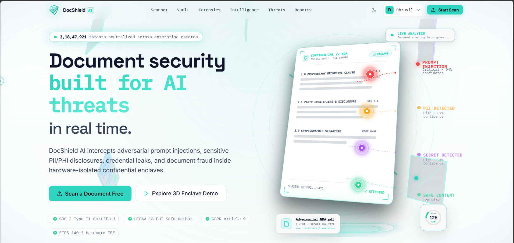
  <p><i>Real-time 3D interactive hero, live threat neutralization counter, and confidential hardware enclave simulation.</i></p>
</div>

---

### Core Security Engines & Threat Architecture
<div align="center">
  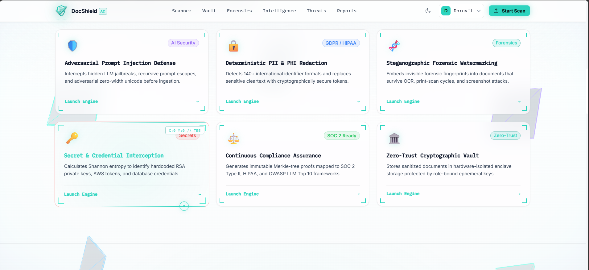
  <p><i>Six dedicated security engines running concurrently in hardware-isolated enclave memory.</i></p>
</div>

---

### Interactive 3D Arrival & Laser Scanning Sandbox
<div align="center">
  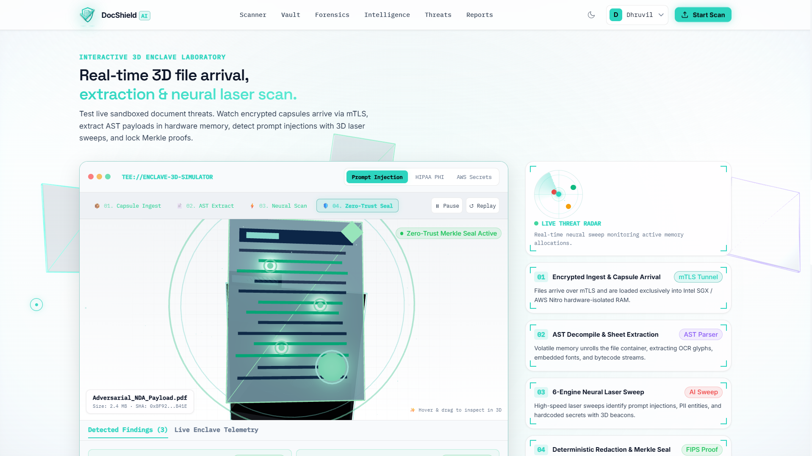
  <p><i>Real-time WebGL interactive scanner simulating encrypted capsule arrival, AST parsing, and neural sweep.</i></p>
</div>

---

### Screening Dashboard & Document Ingestion HUD
<div align="center">
  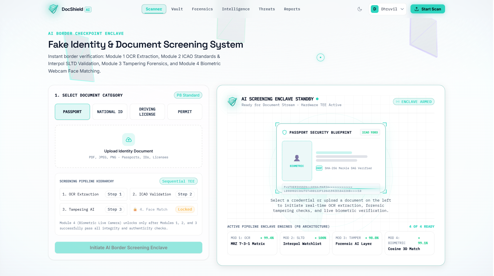
  <p><i>Operational officer HUD with multi-credential selection (Passport, Visa, National ID, Driving License, Permit).</i></p>
</div>

---

### Intelligence Stack & Engine Telemetry
<div align="center">
  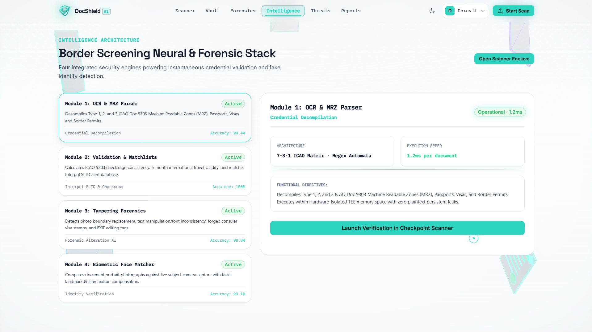
  <p><i>Architecture monitor displaying latency, accuracy benchmarks, and real-time operational status for all 4 engines.</i></p>
</div>

---

### Watchlist Threat Matrix & Alert Feed
<div align="center">
  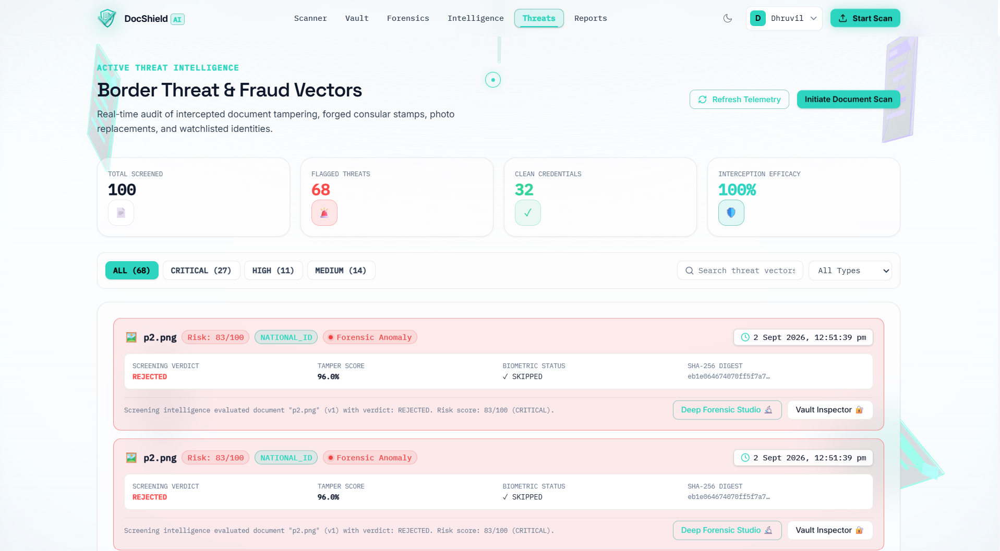
  <p><i>Active threat intelligence registry cross-referencing flagged document numbers, imposters, and Interpol alerts.</i></p>
</div>

---

### Cryptographic Document Vault
<div align="center">
  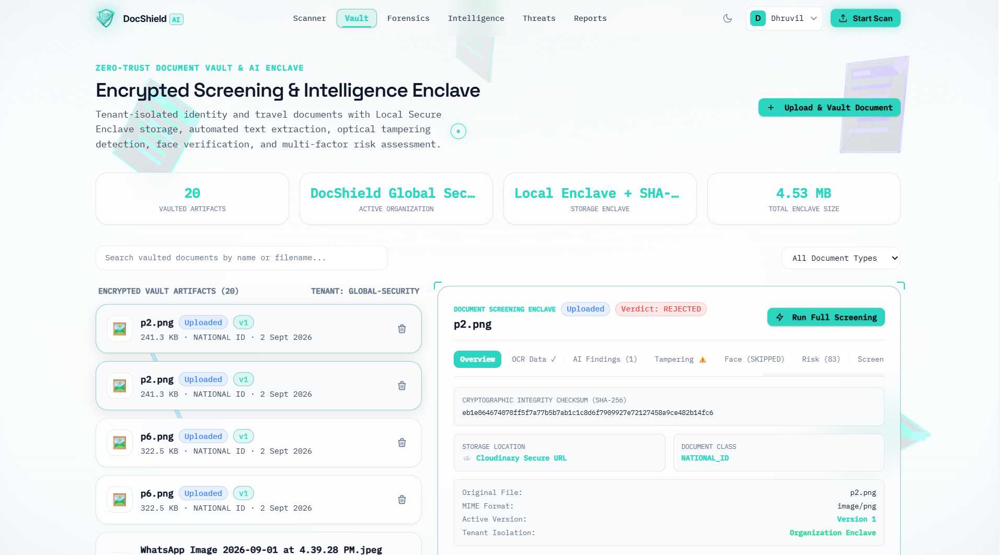
  <p><i>Cloudinary-backed encrypted vault with SHA-256 integrity hashing, status filtering, and version histories.</i></p>
</div>

---

### Executive Border & Compliance Reports
<div align="center">
  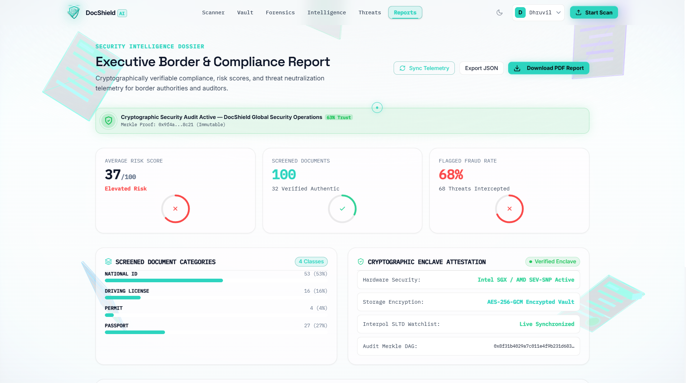
  <p><i>Cryptographically verifiable compliance telemetry, risk score distributions, and formal forensic PDF report export.</i></p>
</div>

---

## 🏗️ System Architecture

DocShield AI employs a high-performance, three-tier decoupled architecture:

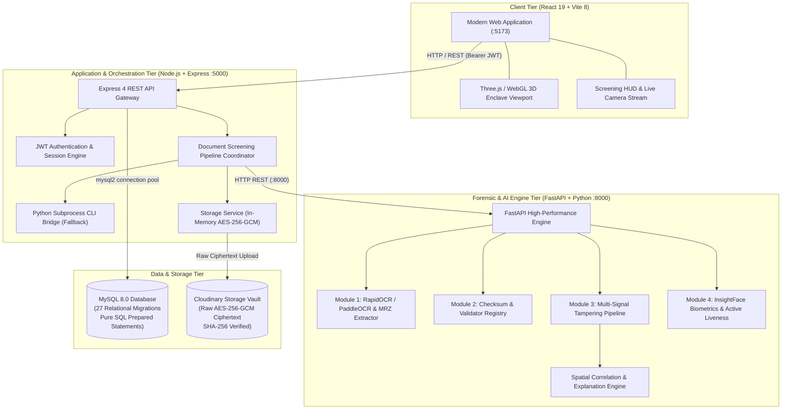

---

## 🔄 How DocShield Works

An end-to-end document screening lifecycle follows nine deterministic steps:

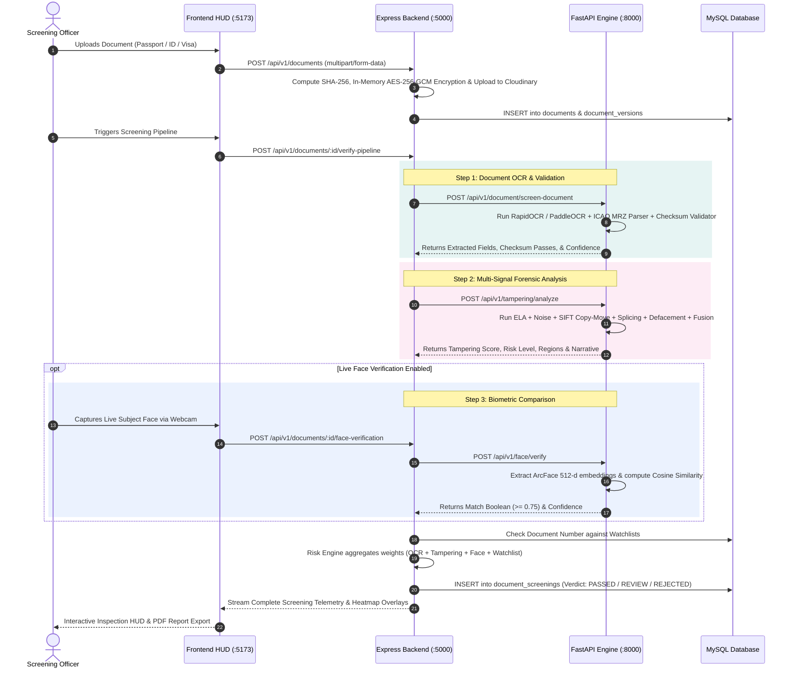

---

## 🔬 Multi-Signal Forensic Tampering Pipeline

The DocShield AI Tampering Engine (`AI/image_tampering/forensic/`) executes a multi-signal, reference-free forensic suite on every document:

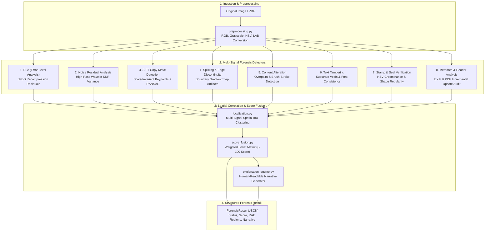

### Detailed Breakdown of Forensic Detectors

#### 1. Error Level Analysis (ELA) (`ela.py`)
- **Physics Principle:** Lossy JPEG compression saves images on an 8x8 discrete cosine transform (DCT) block grid. When an image is modified and re-saved, the modified region is compressed under a different error curve than the untouched substrate.
- **Implementation:** The document is recompressed at a controlled JPEG quality factor ($Q = 90$), the absolute pixel difference between original and recompressed frames is calculated ($|I_{\text{orig}} - I_{\text{recompressed}}|$), amplified by a scale multiplier ($10\times$ to $20\times$), and mapped to a rainbow/jet thermal heatmap.
- **Evaluation Note:** ELA represents an *evidence signal* of differing compression history, not sole proof of tampering. It is intentionally corroborated with noise and edge detectors.

#### 2. Noise Residual Analysis (`noise.py`)
- **Physics Principle:** Digital image sensors and scanner optical heads leave an isotropic Gaussian noise fingerprint (PRNU) across the document substrate. Spliced foreign elements introduce disparate local noise variances.
- **Implementation:** Applies high-pass spatial filtering and median-filtered substrate subtraction to extract the high-frequency residual $R = I - \text{median}(I)$. Computes local signal-to-noise ratio (SNR) variance in sliding $16\times 16$ windows, flagging statistical outliers.

#### 3. SIFT Copy-Move Forgery Detection (`copy_move.py`)
- **Physics Principle:** When fraudsters clone security guilloches, serial numbers, or background patterns to conceal text, identical visual keypoints appear across distinct spatial coordinates.
- **Implementation:** Extracts Scale-Invariant Feature Transform (SIFT) keypoints, constructs a FLANN KD-Tree index, calculates nearest-neighbor feature vector distances, filters Euclidean proximity ($d > 50\text{px}$ to ignore natural texture repetition), and applies RANSAC homography estimation to map source-to-target bounding boxes (`target_bbox`).

#### 4. Splicing & Boundary Step Analysis (`splicing.py`)
- **Physics Principle:** Pasting a cropped headshot into a credential introduces subtle gradient steps and high-frequency edge discontinuities along the perimeter.
- **Implementation:** Evaluates Sobel and Laplacian edge intensity gradients along segmented visual components (such as photo frames) to detect unnatural boundary transitions.

#### 5. Content Defacement & Alteration (`content_alteration.py`)
- **Physics Principle:** Manual overpaint, digital airbrushing, or digital eraser tools create localized patches of zero variance (dead zones) where paper grain is eradicated.
- **Implementation:** Morphology operations (dilation, erosion) and color-space variance analysis detect low-texture solid patches superimposed over complex paper guilloche patterns.

#### 6. Text Tampering & Substrate Voids (`text_tampering.py`)
- **Physics Principle:** Overwritten numbers or dates exhibit baseline misalignment, inconsistent stroke widths, or irregular substrate voids around modified digits.
- **Implementation:** Analyzes character bounding box geometry, horizontal baseline consistency, and contrast transitions between glyph edges and paper texture.

#### 7. Stamp & Consular Seal Verification (`stamp.py`)
- **Physics Principle:** Authentic rubber stamps use wet ink that bleeds into document fibers; digital stamp overlays have unnaturally sharp vector perimeters and uniform opacity.
- **Implementation:** Isolates HSV chrominance ranges (red/blue consular inks), evaluates contour circularity/ellipticity, and checks for boundary gradient bleeding.

#### 8. Metadata & File Structure Analysis (`metadata.py` & `pdf_forensics.py`)
- **Physics Principle:** Document metadata frequently retains traces of editing software or inconsistent timestamps.
- **Implementation:** Inspects EXIF tags for software signatures (`Photoshop`, `GIMP`, `Canva`, `Paint.NET`), creation vs. modification date discrepancies, and parses PDF object streams for incremental revisions and multiple font dictionaries.

---

### Actual Forensic Heatmaps Produced by DocShield AI

The following artifacts represent actual forensic output maps generated by DocShield AI on sample credentials:

<table>
  <tr>
    <td width="33%" align="center">
      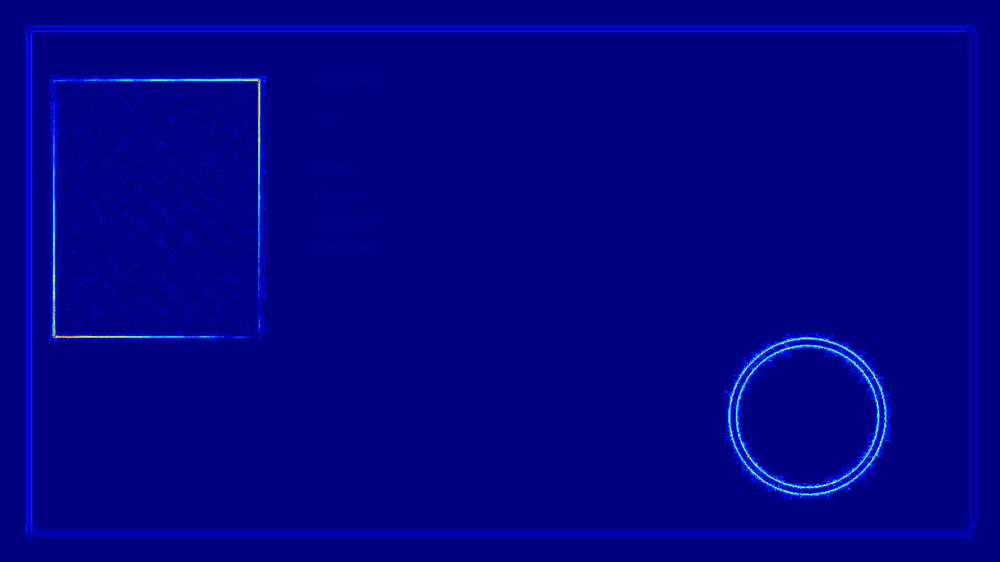
      <br /><b>Error Level Analysis (ELA)</b>
      <p style="font-size:11px;color:#888;">Highlights compression discrepancy around altered dates and photo borders.</p>
    </td>
    <td width="33%" align="center">
      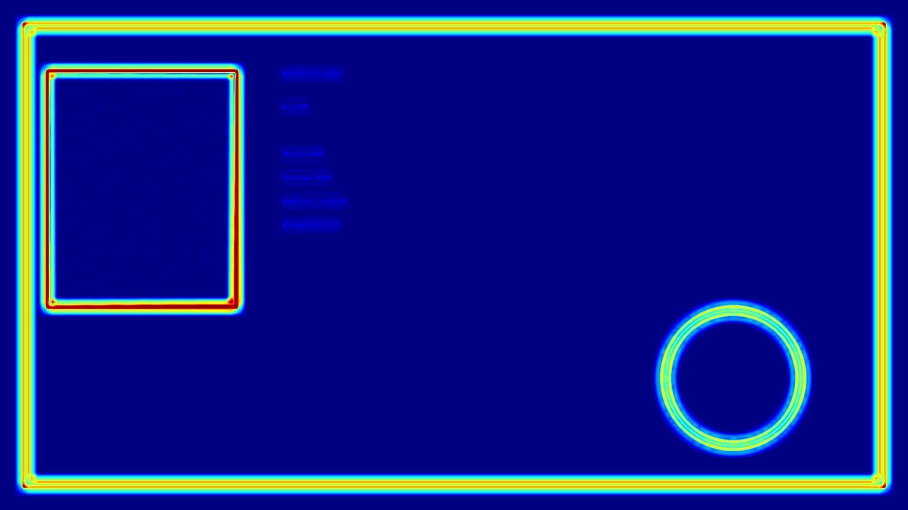
      <br /><b>Noise Residual Map</b>
      <p style="font-size:11px;color:#888;">Local variance reveals spliced elements with different sensor noise.</p>
    </td>
    <td width="33%" align="center">
      
      <br /><b>SIFT Copy-Move Keypoints</b>
      <p style="font-size:11px;color:#888;">RANSAC homography vectors linking duplicated background textures.</p>
    </td>
  </tr>
  <tr>
    <td width="33%" align="center">
      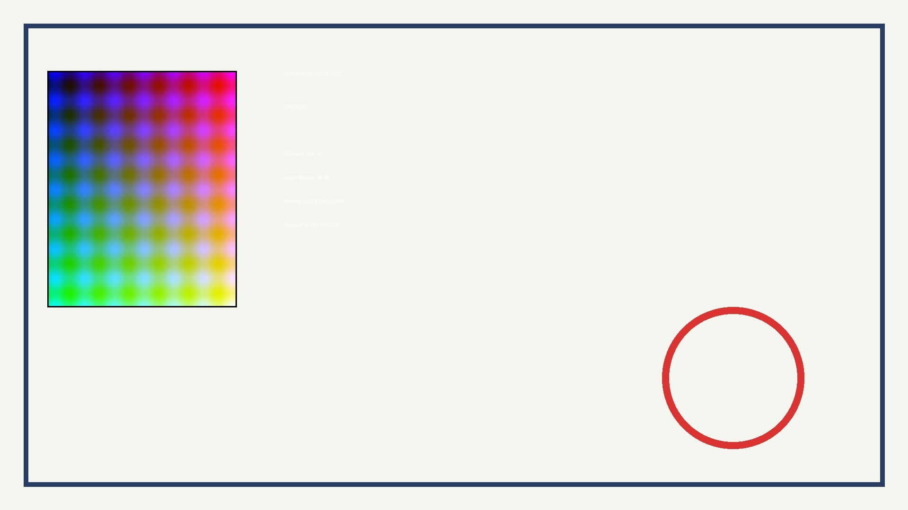
      <br /><b>Splicing & Boundary Steps</b>
      <p style="font-size:11px;color:#888;">Edge gradient abruptness around substituted portrait perimeters.</p>
    </td>
    <td width="33%" align="center">
      
      <br /><b>Consular Stamp Isolation</b>
      <p style="font-size:11px;color:#888;">HSV chrominance segmentation and contour circularity testing.</p>
    </td>
    <td width="33%" align="center">
      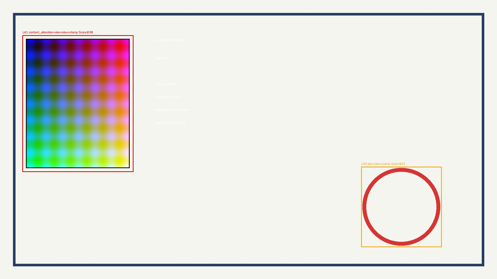
      <br /><b>Fused Tampering Localization</b>
      <p style="font-size:11px;color:#888;">Multi-signal spatial clustering identifying primary suspicious regions.</p>
    </td>
  </tr>
</table>

---

## ⚙️ Technical Highlights & Engineering Decisions

### 1. Pure SQL Architecture (Zero ORM Overhead)
Rather than introducing heavy Object-Relational Mappers (such as Prisma or Sequelize) that obfuscate queries and add connection overhead, the backend uses **raw, parameterized SQL statements** executed through `mysql2` connection pools across **27 structured database migrations**. This guarantees zero SQL injection risk, predictable sub-millisecond query execution, and deterministic schema enforcement.

### 2. Dual Forensic Execution (REST Microservice + Subprocess Bridge)
DocShield AI supports two operational modes:
- **HTTP REST Architecture:** The Node.js backend communicates with the unified FastAPI AI service on port 8000 via streaming HTTP endpoints.
- **Fail-Safe CLI Bridge:** In isolated, air-gapped terminal environments where HTTP routing is restricted, the backend provides an automated subprocess fallback (`pythonBridge.service.js`) that directly executes `image_tampering/forensic/cli.py` via Python CLI and parses structured JSON from stdout.

### 3. Application-Level AES-256-GCM Document Encryption
Sensitive document binaries are never stored in raw plaintext on disk. The storage service (`storage.service.js`) encrypts each payload using **AES-256-GCM** with an ephemeral initialization vector (IV) and stores an authentication tag alongside the file. Even with direct filesystem access, an unauthorized attacker cannot read document images without the enclave encryption key.

### 4. Mathematical Checksum Implementations
DocShield implements strict mathematical checksum algorithms:
- **ICAO Doc 9303 Check Digits:** Standard 7-3-1 weight matrix calculating check digits across Document Number, Date of Birth, Expiration Date, and Composite Checksum.
- **Verhoeff Dihedral D5 Algorithm:** Non-commutative dihedral group $D_5$ check digit calculation for Indian National IDs (Aadhaar), catching all single-digit errors and 95.4% of transposition errors.

---

## 🛠️ Technology Stack

```
DocShield-AI/
├── Frontend (React 19 + Vite 8 + Three.js)
├── Backend  (Node.js v22 + Express 4 + MySQL 8)
└── AI/ML    (FastAPI + Python >= 3.10 + OpenCV + PaddleOCR + ArcFace)
```

### Frontend
- **Framework:** React 19.2.8 with TypeScript 7.0
- **Build Tool:** Vite 8.2.2 with `@tailwindcss/vite` 4.3.3
- **3D Graphics & WebGL:** Three.js (0.185.1), `@react-three/fiber` (9.7.0), `@react-three/drei` (10.7.8), `@react-three/postprocessing` (3.1.0)
- **Animation & UX:** Framer Motion 13.1.1, GSAP 3.15, Lenis Smooth Scroll 1.3
- **Icons & UI:** Lucide React, clsx, tailwind-merge, canvas-confetti
- **Export Engine:** jsPDF 4.2.1 (tamper-evident forensic PDF report generator)

### Backend
- **Runtime:** Node.js v22.18+ (ES Modules)
- **Web Framework:** Express 4.21.2
- **Database Driver:** `mysql2` 3.13 (prepared statements, connection pooling)
- **Authentication & Security:** JWT (`jsonwebtoken` 9.0), `bcryptjs` (12 salt rounds), `helmet` 8.0, `cors`, `express-rate-limit` 7.5
- **Validation:** Zod 3.24.2 (type-safe request schema validation)
- **Upload & Storage:** Multer 2.2 (memory storage buffering), crypto (AES-256-GCM)

### AI, Forensics & Computer Vision
- **Framework:** FastAPI 0.111, Uvicorn 0.35, Pydantic v2 (2.11.7), pydantic-settings 2.2
- **OCR Engines:** RapidOCR (`rapidocr-onnxruntime` 1.2+), PyTesseract 0.3 (Optional: PaddleOCR 3.7 / PaddlePaddle)
- **Computer Vision & Forensic Processing:** OpenCV (`opencv-python` 4.9+, `opencv-contrib-python`), Pillow 12.2, NumPy 2.2, SciPy 1.17, scikit-image 0.26, imageio, tifffile
- **Biometric Face Verification:** InsightFace 0.7.3, ArcFace, ONNX Runtime 1.24, MediaPipe 1.0.1, ONNX 1.15
- **Document & PDF Processing:** PyPDFium2 5.10.1, PyYAML 6.0, python-dateutil, pyclipper, shapely

### Database & Storage
- **Relational Database:** MySQL 8.0+
- **Database Schema:** 27 relational migration files covering Users, Organizations, Documents, Versions, Extractions, Tampering, Biometrics, Risk Scores, and Watchlists
- **File Storage:** Cloudinary Storage Vault (`CLOUDINARY_URL` / `CLOUDINARY_CLOUD_NAME`) with client-side/in-memory AES-256-GCM encryption

---

## 📁 Project Structure

```text
DocShield-AI/
├── AI/                                  # FastAPI AI & Forensic Microservices (:8000)
│   ├── api/                             # FastAPI Routers
│   │   ├── document.py                  # OCR extraction & field validation routes
│   │   ├── face.py                      # 1:1 Face verification & liveness routes
│   │   ├── tampering.py                 # Image tampering forensic analysis routes
│   │   └── schemas.py                   # Pydantic request/response schemas
│   ├── core/                            # Configuration, logging & custom exceptions
│   ├── document_detection/              # Module 1 & 2: OCR & Validation Engines
│   │   ├── ocr/                         # RapidOCR & PaddleOCR engines & document field extractors
│   │   ├── preprocessing/               # Contrast & safe scaling preprocessors
│   │   └── validation/                  # ICAO 9303, Verhoeff D5, & national ID validators
│   ├── face/                            # Module 4: Biometric Face Engine
│   │   └── service.py                   # ArcFace feature extraction & cosine similarity
│   ├── image_tampering/                 # Module 3: Multi-Signal Tampering Engine
│   │   ├── forensic/                    # ELA, Noise, SIFT, Splicing, Defacement, Stamp, Metadata
│   │   │   ├── cli.py                   # Standalone CLI bridge executable
│   │   │   ├── ela.py                   # Error Level Analysis detector
│   │   │   ├── noise.py                 # Noise residual SNR detector
│   │   │   ├── copy_move.py             # SIFT keypoint & RANSAC homography
│   │   │   ├── splicing.py              # Gradient boundary step detector
│   │   │   ├── content_alteration.py    # Overpaint & brush-stroke detector
│   │   │   ├── text_tampering.py        # Substrate voids & glyph alignment
│   │   │   ├── stamp.py                 # Consular stamp & HSV chrominance
│   │   │   └── pdf_forensics.py         # Multi-page PDF stream analysis
│   │   ├── fusion/                      # Evidence Fusion & Spatial Correlation
│   │   │   ├── spatial_correlation.py   # Bounding box IoU clustering
│   │   │   ├── score_fusion.py          # Weighted belief score calculator (0-100)
│   │   │   └── explanation_engine.py    # Human-readable forensic narrative generator
│   │   ├── samples/                     # Clean & tampered test credentials
│   │   └── schemas/                     # ForensicResult Pydantic definitions
│   ├── tests/                           # Automated pytest test suites (120+ tests)
│   ├── app.py                           # Unified FastAPI application entrypoint
│   └── requirements.txt                 # Python dependencies
│
├── backend/                             # Node.js + Express + MySQL Backend (:5000)
│   ├── src/
│   │   ├── config/                      # Environment variables & schema (Zod)
│   │   ├── controllers/                 # HTTP controllers (Auth, Documents, Tampering, Screening)
│   │   ├── database/                    # Database connection pool, migrations & seeds
│   │   │   ├── migrations/              # 27 SQL migration files (001-028)
│   │   │   ├── migrate.js               # Migration runner script
│   │   │   └── seed.js                  # Default user & organization seed script
│   │   ├── middleware/                  # JWT auth middleware, error handlers, rate limiters
│   │   ├── routes/                      # Express route definitions (/api/v1/...)
│   │   ├── services/                    # Business logic & external service bridges
│   │   │   ├── ai/                      # AI client calling FastAPI (:8000)
│   │   │   ├── tampering/               # Python CLI bridge service
│   │   │   ├── storage.service.js       # AES-256-GCM Cloudinary encrypted cloud storage
│   │   │   ├── processingPipeline.service.js # Screening coordinator
│   │   │   └── watchlist.service.js     # Interpol SLTD watchlist matching
│   │   ├── app.js                       # Express app configuration
│   │   └── server.js                    # HTTP server startup
│   ├── package.json                     # Node.js dependencies
│   └── .env.example                     # Backend environment template
│
├── frontend/                            # React 19 + TypeScript + Vite 8 Frontend (:5173)
│   ├── src/
│   │   ├── components/                  # Reusable UI, HUD & 3D WebGL scanner viewports
│   │   │   ├── 3d/                      # Three.js / R3F interactive scene manager
│   │   │   ├── common/                  # DocShieldLogo, CameraCapture, CustomCursor
│   │   │   ├── security/                # ScannerStandbyView, SecurityRing, ScanLine
│   │   │   └── ui/                      # HUD Cards, Buttons, Badges, Modals
│   │   ├── context/                     # AuthContext, OrganizationContext, SceneContext
│   │   ├── pages/                       # Application Pages
│   │   │   ├── Home/                    # Home page with 3D WebGL scanner
│   │   │   ├── Scanner/                 # Document screening HUD & camera capture
│   │   │   ├── Analysis/                # Forensics studio with deep tampering analysis & heatmaps (/forensics)
│   │   │   ├── Intelligence/            # 4-Engine telemetry & architecture overview
│   │   │   ├── Threats/                 # Watchlist threats matrix & alert feed
│   │   │   ├── Vault/                   # Document vault with version history
│   │   │   ├── Reports/                 # Audit logging & jsPDF report generator
│   │   │   └── Auth/                    # Login, Register, Password Reset
│   │   ├── lib/api/                     # Typed Axios/Fetch API client bindings
│   │   ├── types/                       # TypeScript domain interfaces
│   │   ├── App.tsx                      # Route definitions & transitions
│   │   └── main.tsx                     # React DOM entrypoint
│   ├── package.json                     # Frontend dependencies
│   └── vite.config.js                   # Vite + Tailwind CSS configuration
│
├── docs/                                # Documentation assets
│   ├── assets/                          # Official SVG logo & forensic heatmap outputs
│   └── screenshots/                     # 8 high-resolution UI screen captures
│
└── README.md                            # Evaluator-focused project documentation
```

---

## 📡 API Overview

### 1. Python AI Engine Endpoints (`http://127.0.0.1:8000`)

| Method | Endpoint | Description | Request Body / Params |
| :--- | :--- | :--- | :--- |
| `GET` | `/health` | Engine liveness probe | None |
| `GET` | `/ready` | Engine readiness probe (checks OCR service warmup) | None |
| `GET` | `/api/v1/document/document-types` | List accepted document types | None |
| `POST` | `/api/v1/document/screen-document` | Screen credential, extract OCR fields & validate checksums | `file` (Multipart), `document_type` (`passport`, `visa`, etc.) |
| `POST` | `/api/v1/tampering/analyze` | Run multi-signal forensic analysis pipeline | `file` (Multipart image/PDF), `save_debug` (bool) |
| `GET` | `/api/v1/tampering/health` | Tampering module status | None |
| `POST` | `/api/v1/face/detect` | Detect faces in image & return bounding boxes | `file` (Multipart image) |
| `POST` | `/api/v1/face/verify` | 1:1 face verification between document and live capture | `doc_image` (Multipart), `live_image` (Multipart), `threshold` |
| `POST` | `/api/v1/face/liveness` | Active liveness challenge check on video stream | `video` (Multipart MP4), `timeout` (float) |

---

### 2. Node.js Backend API Endpoints (`http://localhost:5000`)

| Method | Endpoint | Access | Purpose |
| :--- | :--- | :--- | :--- |
| `GET` | `/api/v1/health` | Public | System status, database connection latency, uptime |
| `POST` | `/api/v1/auth/register` | Public | Register new user account |
| `POST` | `/api/v1/auth/login` | Public | Authenticate user & issue JWT Access/Refresh tokens |
| `POST` | `/api/v1/auth/refresh-token` | Public | Rotate expired access tokens |
| `GET` | `/api/v1/auth/me` | Authenticated | Fetch current user profile, organization & permissions |
| `POST` | `/api/v1/documents` | Authenticated | Ingest document, verify SHA-256 & encrypt to enclave |
| `GET` | `/api/v1/documents` | Authenticated | List organization documents with pagination & status filters |
| `GET` | `/api/v1/documents/:id` | Authenticated | Retrieve specific document metadata and versions |
| `GET` | `/api/v1/documents/:id/preview` | Authenticated | Stream decrypted document image for officer preview |
| `POST` | `/api/v1/documents/:id/verify-pipeline` | Authenticated | Execute sequential verification (OCR + Forensics + Risk) |
| `POST` | `/api/v1/documents/:id/tampering/analyze` | Authenticated | Trigger standalone tampering forensic analysis |
| `GET` | `/api/v1/documents/:id/tampering` | Authenticated | Retrieve tampering analysis result and fused regions |
| `POST` | `/api/v1/documents/:id/face-verification` | Authenticated | Execute 1:1 facial biometric matching |
| `GET` | `/api/v1/documents/:id/face-verification` | Authenticated | Retrieve face verification score and confidence |
| `POST` | `/api/v1/documents/:id/risk/calculate` | Authenticated | Recalculate multi-factor risk score |
| `POST` | `/api/image-tampering/analyze` | Public / Auth | Direct image tampering analysis endpoint |
| `GET` | `/api/v1/watchlists` | Authenticated | Query Interpol SLTD & national threat watchlists |
| `GET` | `/api/v1/audit-logs` | Authenticated | Query immutable security audit trail |

---

## 🚀 Getting Started & Installation

Follow these instructions to configure and run DocShield AI locally.

### Prerequisites

| Component | Required Version | Verification Command |
| :--- | :--- | :--- |
| **Node.js** | `v18.0.0+` (Tested on `v22.18.0`) | `node -v` |
| **npm** | `v9.0.0+` | `npm -v` |
| **Python** | `>=3.10` | `python --version` |
| **MySQL** | `8.0+` | `mysql --version` |
| **Git** | `2.x+` | `git --version` |

---

### 1. Configure Environment Variables

#### Backend Configuration (`backend/.env`)
Create `backend/.env` based on `backend/.env.example`:

```env
# Server Configuration
NODE_ENV=development
PORT=5000

# MySQL Database Connection
DB_HOST=127.0.0.1
DB_PORT=3306
DB_NAME=docshield_ai
DB_USER=root
DB_PASSWORD=your_mysql_password
DB_CONNECTION_LIMIT=10

# Security & JWT Tokens
JWT_ACCESS_SECRET=docshield_access_secret_key_2026_prod_ready_sec_token_v1
JWT_REFRESH_SECRET=docshield_refresh_secret_key_2026_prod_ready_sec_token_v1
JWT_ACCESS_EXPIRATION=15m
JWT_REFRESH_EXPIRATION=7d

# Frontend CORS
FRONTEND_URL=http://localhost:5173

# Application Document Encryption (AES-256-GCM 256-bit Key)
# Generate via: node -e "console.log(crypto.randomBytes(32).toString('hex'))"
DOC_ENCRYPTION_KEY=your_64_character_hex_encryption_key_here

# Unified AI Backend Service URL
AI_SERVICE_URL=http://localhost:8000
```

> [!TIP]
> **Zero-Config Python AI Engine:**  
> The Python AI Engine (`AI/`) requires **no `.env` file**. All modules (RapidOCR, ArcFace biometrics, and the multi-signal forensic pipeline) automatically initialize with production-ready built-in defaults on startup.

---

### 2. Start the Python AI Engine

Navigate to the `AI/` directory, set up the Python virtual environment, install dependencies, and launch Uvicorn:

#### Windows (PowerShell):
```powershell
cd AI

# 1. Create and activate virtual environment
python -m venv .venv
.\.venv\Scripts\Activate.ps1

# 2. Upgrade pip and install dependencies
python -m pip install --upgrade pip
pip install -r requirements.txt

# 3. Start unified FastAPI engine
python -m uvicorn app:app --host 127.0.0.1 --port 8000 --reload
```

#### Windows (Command Prompt - CMD):
```cmd
cd AI
python -m venv .venv
.venv\Scripts\activate.bat
pip install -r requirements.txt
python -m uvicorn app:app --host 127.0.0.1 --port 8000 --reload
```

#### Linux / macOS:
```bash
cd AI
python3 -m venv .venv
source .venv/bin/activate
pip install -r requirements.txt
uvicorn app:app --host 127.0.0.1 --port 8000 --reload
```

- **Swagger Documentation:** [http://127.0.0.1:8000/docs](http://127.0.0.1:8000/docs)
- **Health Probe:** [http://127.0.0.1:8000/health](http://127.0.0.1:8000/health)

---

### 3. Setup & Start the Backend

Make sure your MySQL server is running and a database named `docshield_ai` exists:

```sql
CREATE DATABASE IF NOT EXISTS docshield_ai CHARACTER SET utf8mb4 COLLATE utf8mb4_unicode_ci;
```

Then in a new terminal:

```bash
cd backend

# 1. Install Node.js dependencies
npm install

# 2. Run database migrations (001-028)
npm run migrate

# 3. Seed initial records, watchlists & admin accounts
npm run seed

# 4. Start backend in development mode
npm run dev
```

- **Backend Health Check:** [http://localhost:5000/api/v1/health](http://localhost:5000/api/v1/health)

#### Default Test Account:
- **Email:** `demo@gmail.com`
- **Password:** `Demo@123`

---

### 4. Start the Frontend Application

In a third terminal:

```bash
cd frontend

# 1. Install dependencies
npm install

# 2. Start Vite development server
npm run dev
```

- **Web Application:** [http://localhost:5173](http://localhost:5173)

---

## 🧭 Product Walkthrough & Evaluation Guide

Follow this 5-minute walkthrough to evaluate DocShield AI:

```
┌─────────────────┐     ┌──────────────────┐     ┌─────────────────┐     ┌──────────────────┐
│ 1. Launch & Auth│ ──> │ 2. Screening HUD │ ──> │ 3. Run Pipeline │ ──> │ 4. Forensics HUD │
└─────────────────┘     └──────────────────┘     └─────────────────┘     └──────────────────┘
```

### Step 1: Access & Authentication
1. Open [http://localhost:5173](http://localhost:5173) in your browser.
2. Experience the interactive 3D home page and enclave laser scanner.
3. Click **Sign In** in the top navigation bar.
4. Enter `demo@gmail.com` and `Demo@123`, then click **Sign In**.

### Step 2: Ingest a Document in the Screening HUD
1. Navigate to the **Scanner** tab (`/scanner`).
2. Select your document type: `PASSPORT`, `VISA`, `NATIONAL_ID`, or `DRIVING_LICENSE`.
3. Drag and drop any sample image from `AI/image_tampering/samples/clean/` or `AI/image_tampering/samples/tampered/` (or upload your own identity document).
4. *(Optional Biometric Verification)*: Click **Capture Face** to enable your webcam and compare your live face against the document photo.

### Step 3: Observe Live Sequential Verification
1. Click **Initiate Screening Pipeline**.
2. Watch the real-time progress indicators:
   - `Module 1: OCR Extraction` decompiles visual fields and ICAO MRZ.
   - `Module 2: Doc Validation` verifies 7-3-1 check digits and expiry bounds.
   - `Module 3: Tampering AI` executes the multi-signal forensic pipeline.
   - `Module 4: Biometrics` extracts facial landmarks and calculates cosine similarity.
3. Review the consolidated verdict: **PASSED**, **REVIEW_REQUIRED**, or **REJECTED**.

### Step 4: Inspect Forensic Evidence & Heatmaps
1. Navigate to **Forensics** (`/forensics`) or inspect directly in the **Tampering AI** tab within the **Scanner** page (`/scanner`).
2. Toggle between visual filters in the Forensics Studio:
   - **Normal View:** Original document preview.
   - **ELA Heatmap:** Error level compression anomalies.
   - **Noise Residual:** High-frequency substrate noise discrepancies.
3. Click on individual detected bounding boxes to inspect the **Evidence Strength**, supporting detectors, and generated forensic narrative.

### Step 5: Verify Threat Registry & Generate Official PDF Report
1. Open **Threats** (`/threats`) to see how flagged credentials match the Interpol watchlist.
2. Navigate to **Reports** (`/reports`) and click **Generate Forensic Audit Report** to export a formal, tamper-evident PDF screening document.

---

## 🧪 Testing & Verification

DocShield AI includes comprehensive automated test suites across both the Python AI engine and Node.js backend:

### 1. Python AI & Forensic Suite (120+ Tests)
Run the automated pytest test suite in the `AI/` directory:

```powershell
cd AI
.\.venv\Scripts\python.exe -m pytest tests/ -v
```

### 2. Standalone Forensic CLI Test
Verify the image tampering detector directly on any sample document via the Python CLI bridge:

```powershell
cd AI
.\.venv\Scripts\python.exe image_tampering/forensic/cli.py --input image_tampering/samples/clean/passport.jpg
.\.venv\Scripts\python.exe image_tampering/forensic/cli.py --input image_tampering/samples/tampered/passport_edited.jpg
```

### 3. Backend Test Suite
Run the Node.js test suites across authentication, document ingestion, and screening:

```bash
cd backend
npm test
```

Or execute individual test suites:
```bash
npm run test:auth        # JWT authentication & session handling
npm run test:tampering   # Python bridge & forensic response parser
npm run test:screening   # Multi-factor risk engine & verdicts
```

---

## 🔒 Security & Privacy Safeguards

- **Pre-Upload AES-256-GCM Encryption:** All document payloads are encrypted in application memory with military-grade 256-bit AES-256-GCM before transmission to Cloudinary. Cloudinary receives and stores only raw binary ciphertext (`.enc`), preventing third-party cloud infrastructure from accessing plaintext credentials or PII.
- **Cryptographic Hashing:** Every incoming document receives a SHA-256 hash at the moment of ingestion. Any subsequent tampering or alteration is detected instantly.
- **Zero-Knowledge Cloud Persistence:** Cloudinary operates strictly as an encrypted ciphertext vault. Decryption keys never leave the backend environment.
- **Secure JWT Authentication:** Token-based authentication with secure HTTP-only cookies, password hashing via bcrypt (12 salt rounds), and continuous session rotation.
- **Git Protection:** All sensitive credentials, environment files (`.env`), and upload caches are strictly ignored in `.gitignore`.

---

## 🗺️ Roadmap

### Current Version (Implemented)
- [x] Unified FastAPI AI engine with RapidOCR / PaddleOCR, ArcFace, and multi-signal forensic pipeline
- [x] Pure SQL Node.js backend with 27 migrations, JWT auth, and secure sessions
- [x] React 19 + TypeScript + Vite 8 frontend with 3D WebGL scanner HUD
- [x] ICAO Doc 9303 MRZ parser and Verhoeff D5 check digit validation
- [x] Multi-signal spatial clustering, IoU bounding box fusion, and narrative engine
- [x] Pre-upload AES-256-GCM encrypted document storage with Cloudinary
- [x] Tamper-evident PDF screening report generation

### Future Milestones
- [ ] **NFC e-Passport Chip Verification:** Direct integration with smart-card readers to cryptographically verify ICAO 9303 Public Key Infrastructure (PKI) digital signatures.
- [ ] **Physical Hologram Light-Angle Analysis:** Multi-frame video analysis checking holographic refraction shifts under rotating smartphone flash illumination.
- [ ] **Distributed Ledger Audit Anchoring:** Anchoring screening hash proofs into private permissioned blockchains for tamper-proof international audit trails.
- [ ] **Multilingual Document Parsing:** Expanding OCR extraction models to Cyrillic, Arabic, and Hanzi script identity cards.

---

## 🛠️ Troubleshooting

### 1. Port Already in Use
If port `5000` (Backend), `8000` (FastAPI), or `5173` (Frontend) is already occupied:

```powershell
# Windows: Find PID and terminate
netstat -ano | findstr :5000
taskkill /PID <PID> /F
```

### 2. Python Virtual Environment Execution Policy (Windows)
If running `.\.venv\Scripts\Activate.ps1` gives an `ExecutionPolicy` error:

```powershell
Set-ExecutionPolicy -Scope Process -ExecutionPolicy Bypass
.\.venv\Scripts\Activate.ps1
```

### 3. OCR & ONNX Model Initialisation
On first startup, RapidOCR / PaddleOCR automatically initializes detection and recognition weights. Ensure an active internet connection on the initial run if models need to be cached locally. Subsequent executions run completely offline.

### 4. MySQL Connection Refused
If `npm run migrate` or `npm run dev` fails with `ECONNREFUSED 127.0.0.1:3306`:
1. Verify MySQL service is active: `Get-Service -Name *mysql*`
2. Ensure database `docshield_ai` exists.
3. Check credentials in `backend/.env`.

<div align="center">
  <!-- Cyber Animated Banner Footer (All-in-One: Logo, Title, Moving Animation, Enclave Specs) -->
  <a href="#-table-of-contents">
    
  </a>

  <br /><br />

  <p>
    <a href="#-table-of-contents">⬆️ <b>Return to Top</b></a> •
    <a href="#-implemented-features--core-capabilities-in-short">⚡ <b>Features Matrix</b></a> •
    <a href="#-system-architecture">🏗️ <b>System Architecture</b></a> •
    <a href="#-multi-signal-forensic-tampering-pipeline">🔬 <b>Forensic Pipeline</b></a> •
    <a href="#-api-overview">📡 <b>API Endpoints</b></a>
  </p>

  <br />
</div>
